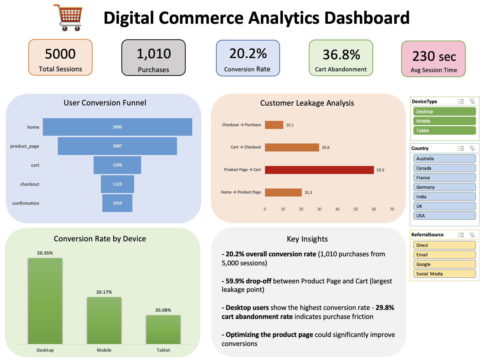

# Digital Commerce Analytics Dashboard

## 📌 Objective
Analyze customer journey data to identify conversion bottlenecks, user behavior patterns, and opportunities to improve purchase performance.

---

## 📊 Dataset
- 5,000 user sessions
- Features: Device Type, Country, Referral Source, Time on Page, Funnel Stage Activity
- Session-level e-commerce funnel dataset

---

## 🧠 Key Insights
- 20.2% overall conversion rate (1,010 purchases from 5,000 sessions)
- 59.9% drop-off between Product Page and Cart, representing the largest funnel leakage point
- 36.8% cart abandonment rate indicates purchase friction
- Desktop users show the highest conversion rate
- Average session duration of 230 seconds reflects strong user engagement

---

## 💡 Business Recommendations
- Optimize the Product Page experience to reduce drop-offs
- Simplify the add-to-cart process and reduce purchase friction
- Investigate cart abandonment drivers through user behavior analysis
- Improve conversion opportunities for Mobile and Tablet users

---

## 🛠 Tools Used
- Python (Pandas, NumPy)
- Matplotlib, Seaborn
- Microsoft Excel
- Pivot Tables & Pivot Charts
- Interactive Slicers

---

## 📈 Dashboard Features
- KPI Tracking
- User Conversion Funnel
- Customer Leakage Analysis
- Device Performance Analysis
- Interactive Filtering with Slicers
- Actionable Business Insights

---

## 🚀 Project Highlights
- Performed end-to-end funnel analysis on 5,000 user sessions
- Identified the primary conversion bottleneck in the customer journey
- Built an interactive Excel dashboard with dynamic filtering
- Delivered actionable recommendations to improve conversion performance

---

## 📸 Dashboard

